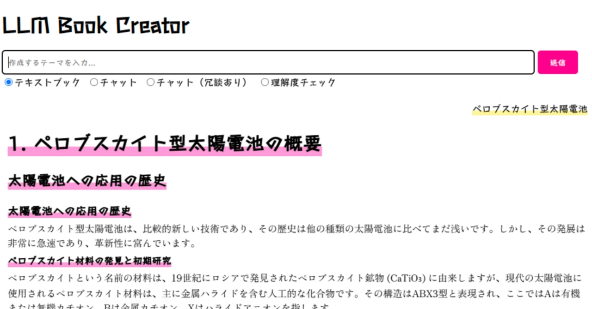

# LLM Book Creator
- LLM Book Creator は、ChatGPTを用いて指定したテーマに基づいて本を生成するためのウェブアプリケーションです。このツールは、教科書、チャット形式の対話、理解度チェックなど、多様なフォーマットでコンテンツを作成できます。<ins>テーマ名を入力するだけでA4で20ページ程度、50円前後、30秒程度</ins>で出力されます。
- LLM Book Creator is a web application that generates books based on specified themes using ChatGPT. This tool can create content in various formats, including textbooks, chat-style dialogues, and comprehension checks. Simply by entering a theme name, it can output around 20 pages in A4 size, at a cost of approximately 50 yen, in just about 30 seconds.
<br>

## 特徴/ Features
- **多様なフォーマット**:
  - 教科書形式 (Textbook)
  - チャット形式 (Chat)
  - 冗談を交えたチャット形式 (Chat with Comedy)
  - 理解度チェック形式 (QA Check)
  - 同じテーマで教科書形式→チャット形式→理解度チェック形式と読み進めることで効率的・印象的な理解を実現！
- **リアルタイムレンダリング**:
  - MathJax を使用して数式をきれいに表示
- **柔軟なカスタマイズ**:
  - テーマとフォーマットを自由に選択可能
- **キャラクター対応**:
  - ずんだもん・ずん子のセリフ付きチャット表示に対応
- **Various Formats**:
  - Textbook Format
  - Chat Format
  - Chat with Comedy
  - QA Check Format
  - Achieve efficient and impactful understanding by progressing through the same theme in Textbook → Chat → QA Check formats!
- **Real-Time Rendering**:
  - Beautifully display mathematical equations using MathJax.
- **Flexible Customization**:
  - Freely select themes and formats.
- **Character Support**:
  - Supports chat displays with dialogue from Zundamon and Zunko.

## セットアップ / Set Up
1. OpenAI API Keyを設定(app.py) / Set OpenAI API Key in app.py
   ```bash
   api_key=""
   ```
3. 必要な依存ライブラリをインストールしてください / Please install the required dependency libraries.
   ```bash
   pip install flask openai
   ```
4. Flaskサーバーを起動 / Start the Flask server.
   ```bash
   python app.py
   ```
## 実行 / Execution
1. テーマを入力 / Enter a Theme
   - 入力ボックスにテーマを入力します (例: "量子力学" や "AIの基礎")
   - 希望のフォーマットを選択し、送信 ボタンを押します。
   - Input your desired theme into the text box (e.g., "Quantum Mechanics" or "Basics of AI").
   - Select your preferred format and click the "Submit" button.
2. 結果を確認 / Review the Results
   - 生成された内容は画面に表示されます。
   - 必要に応じて内容をコピーして利用できます。
   - The generated content will be displayed on the screen.
   - You can copy and use the content as needed.

## サンプル / Sample
- 教科書形式 (Textbook)<br>
- 理解度チェック形式 (QA Check)<br>

## 免責事項 / Disclaimer
本プログラム（以下「本ソフトウェア」）は、現状有姿（"AS IS"）で提供されます。本ソフトウェアの使用に関する以下の事項をご了承ください。
- 保証の否認: 本ソフトウェアは、明示的または黙示的を問わず、いかなる保証もなく提供されます。特定の目的への適合性、商品性、非侵害性に関する保証を含みますが、それに限定されません。
- 責任の制限: 本ソフトウェアの使用、または使用不能に起因する、いかなる損害（直接的、間接的、偶発的、特殊的、結果的損害を含むがこれに限らない）についても、著作者または権利保有者は一切の責任を負いません。
- 自己責任の原則: 本ソフトウェアの使用は、すべてユーザー自身の責任において行われるものとします。本ソフトウェアの使用によって生じた問題について、著作者または権利保有者は一切の責任を負いません。


  The program (hereinafter referred to as "the Software") is provided "AS IS". Please note the following terms regarding the use of the Software:


- Disclaimer of Warranties: 
The Software is provided without any warranties, express or implied. This includes, but is not limited to, warranties of fitness for a particular purpose, merchantability, and non-infringement.

- Limitation of Liability: 
The authors or copyright holders shall not be held liable for any damages (including, but not limited to, direct, indirect, incidental, special, or consequential damages) arising from the use of or inability to use the Software.

- Use at Your Own Risk: 
The use of the Software is entirely at the user's own risk. The authors or copyright holders assume no responsibility for any issues that may arise from the use of the Software.
